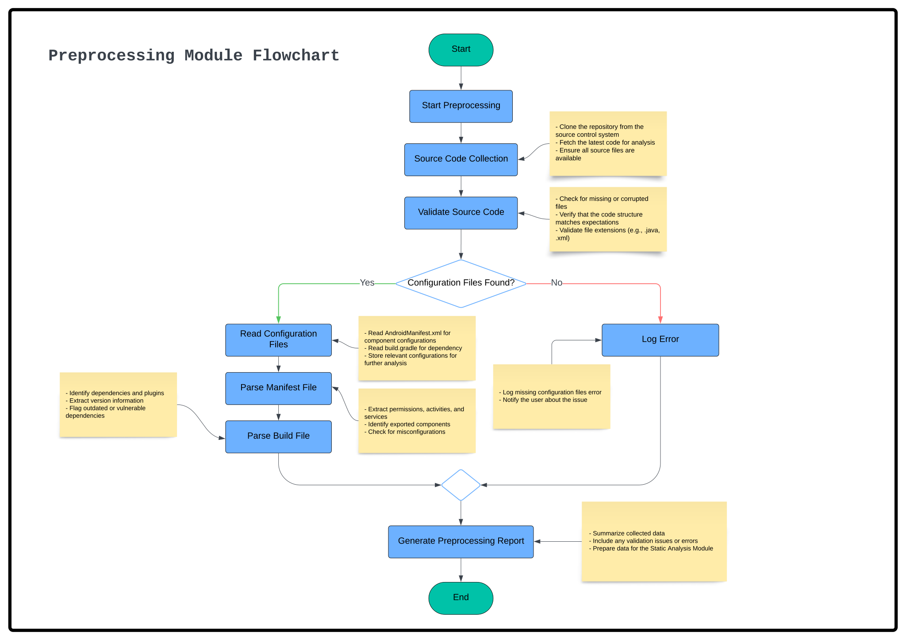
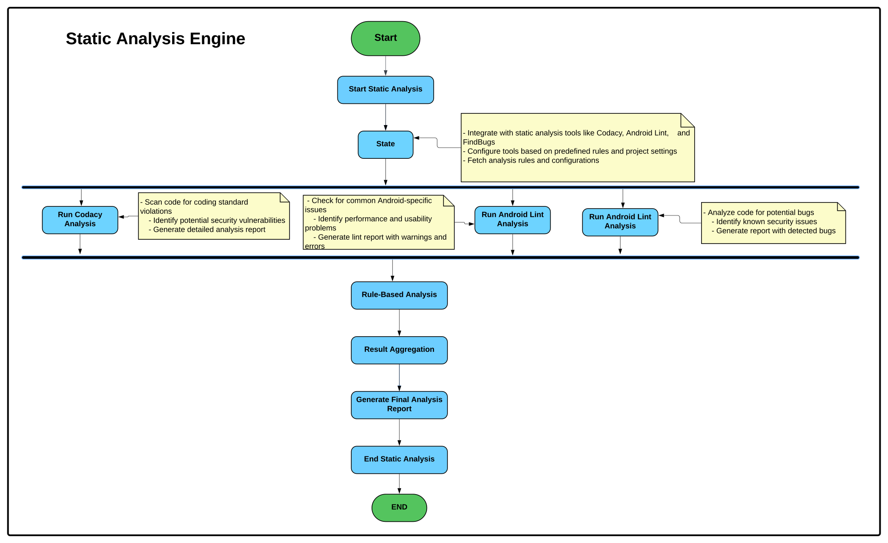
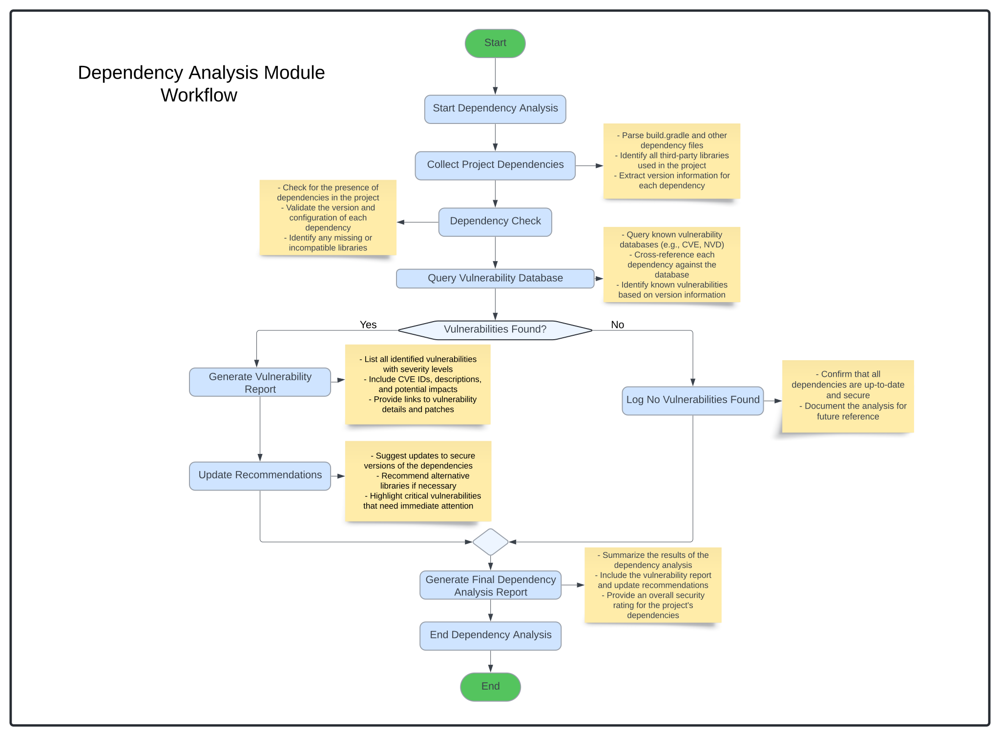

# Architecture Overview

## Introduction

The **Android Vulnerability Analysis Framework** is designed to provide a comprehensive static analysis solution for identifying vulnerabilities in Android applications. This framework automates the process of analyzing source code, configuration files, and dependencies to detect security flaws early in the development cycle.

## Core Components

The framework is built around several core components that work together to perform static analysis and reporting. Each component has a specific role in the overall architecture.

### 1. **Preprocessing Module**

This module is responsible for preparing the input data before the analysis begins. It includes tasks such as:
- **Source Code Collection**: Fetches the source code from the repository.
- **Configuration Analysis**: Reads configuration files like `AndroidManifest.xml` and `build.gradle`.

### 2. **Static Analysis Engine**

The Static Analysis Engine is the core of the framework. It uses multiple analysis tools to scan the source code for vulnerabilities.

- **Tool Integration**: The engine integrates with static analysis tools like Codacy, Android Lint, and FindBugs.
- **Rule-Based Analysis**: Applies security rules and coding standards to detect common issues such as insecure API usage, improper permission settings, and hardcoded credentials.
- **Result Aggregation**: Combines results from all tools into a unified format.

### 3. **Configuration Analysis Module**

This module specifically focuses on analyzing configuration files:

- **Manifest Analysis**: Checks the `AndroidManifest.xml` for insecure configurations like exported components and permission issues.
- **Build Configuration Analysis**: Reviews the `build.gradle` files for insecure settings and outdated dependencies.

*Add a schematic here that shows how the Configuration Analysis Module interacts with the `AndroidManifest.xml` and `build.gradle` files.*

### 4. **Dependency Analysis Module**

This module evaluates third-party libraries and dependencies used in the project:

- **Dependency Check**: Identifies all third-party libraries used in the project.
- **Vulnerability Database**: Compares libraries against a database of known vulnerabilities.
- **Update Recommendations**: Suggests updates for outdated or vulnerable dependencies.

### 5. **Reporting Module**

The Reporting Module generates detailed reports based on the analysis results:

- **Summary Report**: Provides an overview of all identified vulnerabilities.
- **Detailed Report**: Includes specific code snippets, potential impact, and recommendations for each vulnerability.
- **Severity Ranking**: Classifies vulnerabilities based on their severity to prioritize remediation efforts.

*Include a sample report layout diagram here, showing sections like "Summary", "Detailed Findings", and "Severity Ranking".*

## Integration Workflow

The typical workflow of the framework involves the following steps:

1. **Input**: Source code and configuration files are provided to the framework.
2. **Preprocessing**: The Preprocessing Module collects and prepares data.
3. **Static Analysis**: The Static Analysis Engine scans the code for vulnerabilities.
4. **Configuration and Dependency Analysis**: Specific modules analyze configuration files and third-party libraries.
5. **Result Aggregation**: All findings are aggregated and formatted.
6. **Reporting**: The final report is generated and shared with the development team.

*Create a workflow diagram here that visualizes the entire process from Input to Reporting.*

## Conclusion

This modular architecture ensures that the framework is scalable and can be extended to support additional analysis tools and modules in the future. The integration of various tools and the unified reporting format make it easy for developers to identify and fix security issues early in the development cycle.

*You can add a high-level architecture diagram here that shows all the core components and their interactions.*

